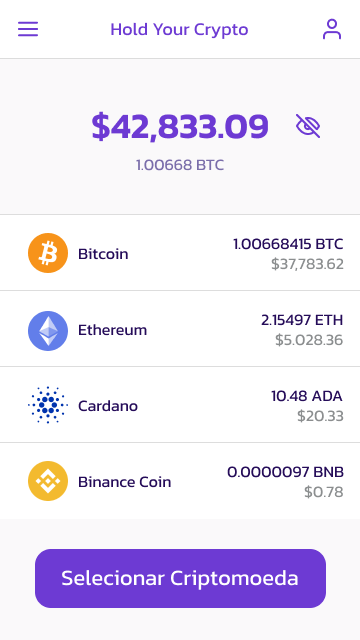

<h1 align="center">
  HOLD YOUR CRYPTO: DESENVOLVIMENTO DE UM APLICATIVO PARA GESTÃO DE INVESTIMENTOS EM CRIPTOMOEDAS
  <br/>
  <div>
    
    
    
    
  </div>
  <br/>
  
</h1>

## Descrição

Aplicativo desenvolvido como projeto de TCC do curso de Engenharia de Software do Uni-FACEF.

## Resumo

Este repositório contém todos os artefatos desenvolvidos no projeto.

## Conteúdo

**Código-fonte**: Código do aplicativo desenvolvido em React Native com Expo.

**Documentos**: Documentos do projeto como o próprio artigo, diagramas, a apresentação etc.

**Telas**: Imagens das telas prototipadas para o sistema

## Layout

Você pode visualizar o layout do projeto através [deste link](https://www.figma.com/file/8gqd5pP7KbNTAC3YmiIZWt/HYC).

## Executando o projeto

Utilize o **yarn** ou o **npm install** para instalar as dependências do projeto.
Em seguida, inicie o projeto.

```cl
expo start
```
